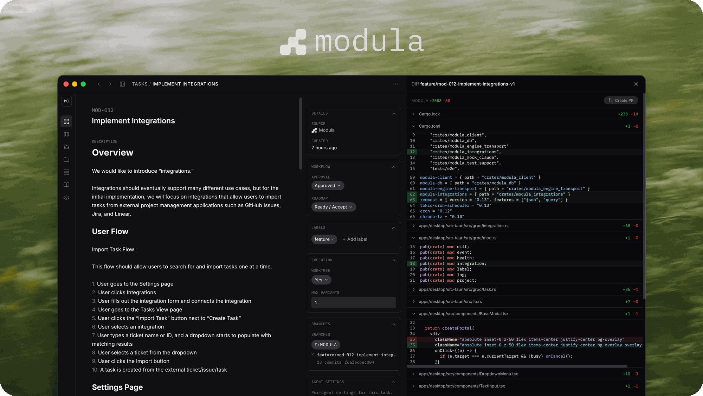

<div align="center">



### Agentic Development Environment

[](https://github.com/modula-sh/modula/stargazers)
[](https://www.rust-lang.org/)
[](https://tauri.app/)

<br />

Turn tasks into shipped code with agents.

<br />

[Download Modula](https://github.com/modula-sh/modula/releases/) &nbsp;&bull;&nbsp; [Development](#development) &nbsp;&bull;&nbsp; [Docs](https://docs.modula.sh) &nbsp;&bull;&nbsp; [Discord](https://discord.gg/vBwpUt4JM)

</div>

## From Ticket to Shipped Code, Autonomously

Modula is an agentic orchestration platform that automates your development workflow end to end. Bring your own coding agents (Claude, Codex, OpenCode, and others) and let them run the whole thing in one place, instead of jumping between your terminal, IDE, AI agents, and issue tracker.

- **Your whole workflow in one place**: tickets, agents, code, and review, with no tool-switching
- **Runs on its own**: agents pick up work automatically as it progresses, not when you prompt them
- **Explore in parallel**: try several solutions to a task at once, then pick the best
- **Worktree-isolated**: every attempt gets its own branch and worktree, so parallel work never collides
- **Local-first**: one binary, one SQLite DB, no cloud
- **Provider-agnostic**: bring any CLI coding agent of your choice

## Features

| Feature | Description |
|:--------|:------------|
| **Event-driven automation** | Agents pick up work on their own as it's ready, so tasks keep moving without you nudging each step |
| **Human-in-the-loop** | Optional: let it run fully autonomously, or stay in control by approving work and answering agents when they pause to ask |
| **Ticket threads** | Talk to your agents as a group on each ticket: ask questions, give direction, and follow their decisions in one place |
| **Built-in chat** | Chat directly with an agent to gather information or make quick, surgical changes |
| **Review before merge** | See exactly what changed, refine it with feedback or quick edits, then merge when you're happy, all in one place |
| **Customizable agents** | Define each agent's job, instructions, and when it runs, then reshape the workflow to match how you work |
| **Parallel variants** | Explore several solutions to the same task at once, then pick the one you like best |
| **Isolated by default** | Each variant works in its own isolated branch, so parallel attempts never collide |
| **Configurable workflow** | Tailor the stages a task moves through to fit your process |
| **Bring your own model** | Claude, Codex, and OpenCode work out of the box, and you choose the model for each |
| **Local and self-hosted models** | Point a provider at a local or self-hosted model to keep everything on your machine |
| **Live progress** | Watch every agent work in real time |
| **Works with any tracker** | Pull tasks from Jira, Linear, GitHub Issues, or your own source, kept in sync automatically |
| **Self-building knowledge base** | Agents build up a shared understanding of your codebase, getting smarter with every task |

## Supported Providers

Bring your own coding agents. Supported providers:

| Provider | Status |
|:---------|:-------|
| [Claude Code](https://github.com/anthropics/claude-code) | Fully supported |
| [OpenCode](https://github.com/opencode-ai/opencode) | Fully supported |
| [Codex CLI](https://github.com/openai/codex) | Fully supported |
| More coming soon | |

## Install

[Download Modula](https://github.com/modula-sh/modula/releases/)

## Development

```bash
./scripts/dev.sh      # build + run the app for development (engine, dashboard, native window)
./scripts/build.sh    # build the packaged desktop app
```

See [`docs/MODULA.md`](docs/MODULA.md) for requirements, dev modes, packaging, and tests, and [`docs/CLI.md`](docs/CLI.md) for the `modula` CLI reference.

## Configuration

State lives under `~/.modula/` (override the root with `MODULA_DIR`). See [`docs/MODULA.md`](docs/MODULA.md#configuration) for environment variables and full configuration.

## Local-First by Design

- **All state on your machine** — SQLite DB and markdown artifacts under `~/.modula/`
- **You own the providers** — Modula never proxies API calls; agents shell out to your CLI binaries with your credentials
- **Run models locally** — point a provider at a local or self-hosted model (e.g. via OpenCode) so your code and prompts never leave your machine
- **No telemetry** — the engine doesn't phone home

## Tech Stack

<p>
  <a href="https://www.rust-lang.org/"></a>
  <a href="https://tokio.rs/"></a>
  <a href="https://github.com/launchbadge/sqlx"></a>
  <a href="https://www.sqlite.org/"></a>
  <a href="https://grpc.io/"></a>
  <a href="https://tauri.app/"></a>
  <a href="https://react.dev/"></a>
  <a href="https://vitejs.dev/"></a>
  <a href="https://tailwindcss.com/"></a>
</p>

## Contributing

Contributions welcome. The typical loop:

1. Fork the repo and create a feature branch (`git checkout -b feature/your-feature`)
2. Make your changes and add tests where it makes sense
3. Build and run the tests (see [`docs/MODULA.md`](docs/MODULA.md))
4. Open a Pull Request

For larger changes, opening an issue first to align on the approach saves rework.

The architectural ground rules — pipeline-driven state, DB as source of truth, spawn boundaries, theming, etc. — are in [`CLAUDE.md`](CLAUDE.md). Skim it before sending a PR that touches the engine or the dispatcher.

## Community

- **[GitHub Issues](https://github.com/modula-sh/modula/issues)** — bug reports and feature requests
- **[GitHub Discussions](https://github.com/modula-sh/modula/discussions)** — questions, design ideas, show-and-tell

## License

Modula is licensed under the [Elastic License 2.0](LICENSE). You can use, copy, modify, and self-host it freely; you may not provide it to third parties as a hosted or managed service. See [`LICENSE`](LICENSE) for the full terms.
